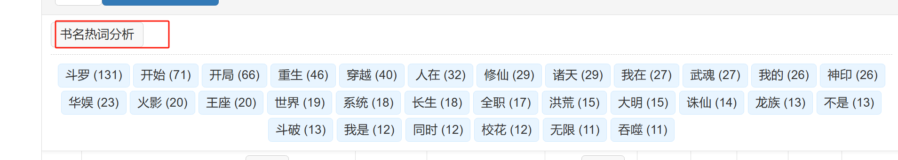

# 起点图表格筛选增强脚本

[**🚀 立即从 GreasyFork 安装**](https://greasyfork.org/zh-CN/scripts/543774)

这是一个为 [起点图](https://www.qidiantu.com/) 网站定制的浏览器脚本，旨在增强其数据表格的浏览体验。通过注入一系列便捷的筛选和分析工具，帮助用户从海量数据中快速定位到自己关心的内容。

---

## 缘起

起点图是分析网络小说数据的重要网站，但其默认的表格功能相对基础，当面对成千上万条数据时，查找和分析特定类型的作品变得十分困难。特别是网站的懒加载机制，使得传统的筛选方法无法覆盖到所有数据。

为了解决这个问题，我开发了这个脚本。它不仅提供了强大的多维度筛选功能，还加入了书名热词分析，更重要的是，它能完美兼容懒加载，确保您看到的就是全部数据筛选后的结果。

## 🚀 功能特性

- **多维度筛选**：在“书籍分类”和“作者等级”列标题处添加了下拉多选菜单，可以同时选择多个条件进行筛选。
- **兼容懒加载**：核心功能之一。脚本能够自动监听并处理网站的懒加载行为，确保筛选功能对页面滚动后加载的新数据行同样有效。
- **书名热词分析**：一键提取当前表格所有书名中的高频词汇（二字词），并按热度排序展示。
- **热词点击筛选**：点击分析出的热词标签，即可快速筛选出所有包含该热词的书籍。
- **悬浮工具栏**：所有操作按钮都集成在一个页面顶部的悬浮工具栏中，方便随时操作。
- **清爽的 UI**：筛选控件和热词面板都经过精心设计，与原网站风格保持一致，操作直观。

## 🛠️ 如何使用

1.  **安装脚本管理器**：
    你需要在浏览器上安装一个用户脚本管理器。推荐使用 [Tampermonkey](https://www.tampermonkey.net/) (支持 Chrome, Firefox, Edge, Safari 等主流浏览器)。

2.  **安装本脚本**：
    点击下方的链接进行安装：
    - [**从 GreasyFork 安装 (推荐)**](https://greasyfork.org/zh-CN/scripts/543774) (可获取自动更新)
    - [**从 GitHub 安装**](./qidiantu-filter.user.js) (直接安装源文件)

3.  **访问目标页面**：
    安装完成后，访问 [起点图首订](https://www.qidiantu.com/shouding/) 下的任意榜单页面。脚本将自动生效。

4.  **开始使用**：
    - 在表格头部的“分类”和“等级”列，会出现对应的筛选按钮，点击即可进行多项选择。
    - 点击页面顶部的“书名热词分析”按钮，即可生成并使用热词筛选。

## 📸 预览

**筛选控件：**
在表格的“分类”和“等级”列中，会增加一个下拉筛选按钮。激活筛选时，按钮会高亮显示。

**热词分析面板：**
点击“书名热词分析”后，工具栏下方会展开热词区域，展示高频词及其出现次数。点击热词即可筛选。

## 📝 反馈与贡献

如果你在使用过程中遇到任何问题，或有功能改进的建议，欢迎通过以下方式提出：
- **提交 Issue**：在本项目 GitHub 页面的 [Issues](https://github.com/your-username/your-repo/issues) 中创建新的 issue。

欢迎对本项目进行 Fork 并提交 Pull Request。

## 📄 许可

本项目采用 [MIT License](./LICENSE) 开源许可。

## 项目更新日志
* 2025-07-27: 新增移动端显示优化，改善手机浏览器上的表格布局与可读性。
